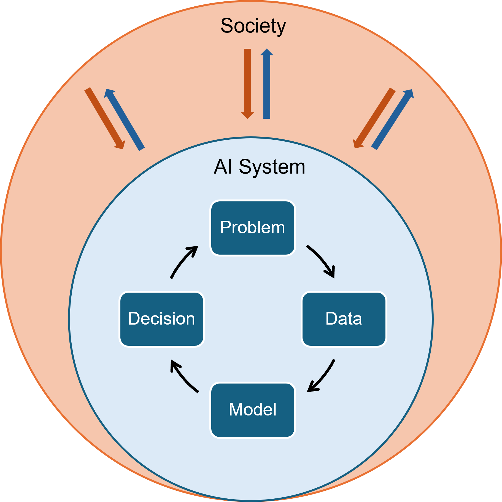

# A Human-Centric Framework of Responsible AI

## The Socio-Technical System 
We present a sociotechnical system's view of how an automated decision-making system, powered by data and modern ML / AI tools (which we refer to as "AI system" in the following figure), interact with the society around it.

To begin, we note that the technical system (inner blue circle) is nested within the society (outer orange circle). This is a key feature of the sociotechnical perspective - a technical system does not exists in a vacuum; it is embedded in the larger society in which it operates, and the two parts constantly interact with each other.

These interactions provide a convenient lens to think about Responsible AI issues. 
- Society **informs the design** of the AI system and **keeps the system accountable** (orange arrows).
    1. Various regulatory bodies (governments, institutions, legal systems, etc.) need to specify the _ideal responsibility objectives_. That is, we need to tell the AI system what we believe is fair / transparent / private, which reflects the values of preferences of the society.
    2. AI system's decisions will not be 100% perfect. The same entities are also responsible for checking whether the AI system's outputs adhere to the responsibility objectives, and provide recourse for stakeholders in case of violation. 
- AI system **supports the decision-making** of society, by providing data-driven predictions that are useful for decision-making.

Furthermore, inside the AI system, we emphasize at least four elements that form a "lifecycle" of system development:
- **Problem**: formulating the decision problem that the AI system is designed to address, and operationalize the responsible AI objectives. 
- **Data**: collect, examine, and process the data used for building the AI system, potentially accounting for responsible AI objectives.
- **Model**: build / train AI models, potentially accounting for responsible AI objectives.
- **Decision**: the AI system makes decisions, which become supportive information for human stakehonders.