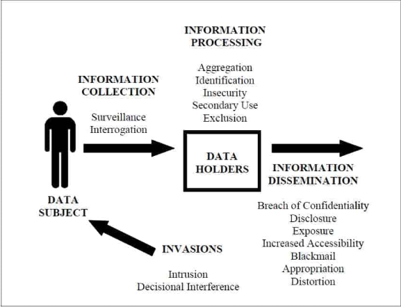

# Conceptual Framework of Privacy

> **Acknowledgement**: this chapter is adapted from Professor [Russell Funk](https://carlsonschool.umn.edu/faculty/russell-funk)'s lectures in the MSBA 6141 "Ethics and Data Privacy". 

## What is Privacy and Why it is Important?

Privacy is a multifaceted concept with profound implications for individuals, organizations, and society. At its core, it encompasses the right to control personal information and determine when, how, and to what extent such information is shared. This control is essential for safeguarding individual autonomy and fostering trust in personal and professional relationships. In an increasingly digital world, where data is collected and shared at unprecedented rates, privacy has become both a personal and collective concern. Beyond individual preferences, privacy establishes moral obligations for businesses to respect the rights of consumers, employees, and stakeholders, ensuring ethical data practices and fostering societal trust.

### Philosophical Foundations of Privacy
The philosophical foundations of privacy are deeply rooted in the ethical frameworks that have been discussed in Chapter {doc}`0-3-philosophy`, particularly _utilitarianism_ and the _rights-and-duties_ approach. Utilitarianism emphasizes the role of privacy in enhancing individual well-being by reducing societal pressures, such as the [tyranny of the majority](https://en.wikipedia.org/wiki/Tyranny_of_the_majority)—a concept articulated by [John Stuart Mill](https://en.wikipedia.org/wiki/John_Stuart_Mill). Mill argued that privacy creates a necessary separation between public and private spheres, enabling individuals to resist conformity and embrace diverse perspectives. This diversity, Mill believed, is essential for societal progress and the pursuit of truth.

The rights-and-duties approach, on the other hand, frames privacy as an inherent right essential for autonomy and informed consent. This perspective highlights the ethical imperative of treating individuals as ends in themselves rather than means to an end (which is different from the utilitarianism perspective that treats privacy protection as a means to well-being). Modern privacy regulations, such as the General Data Protection Regulation (GDPR), draw heavily from this approach. GDPR mandates transparency and informed consent, ensuring individuals have control over how their data is collected and used, aligning with the broader principle of respecting human dignity and autonomy.

### Privacy Framework
[Daniel Solove](https://www.danielsolove.com/), a prominent scholar in privacy law and ethics, developed a comprehensive framework to address and categorize privacy concerns. Solove's framework identifies distinct stages of data interaction, including collection, processing, dissemination, and invasion. By categorizing these concerns, Solove provides a roadmap for analyzing how data practices impact privacy and ethical decision-making. The framework emphasizes the importance of understanding privacy not as a monolithic concept but as a dynamic interplay of various processes. Solove's work highlights the need for adaptive privacy frameworks to keep pace with rapidly evolving technologies and their implications on data ethics. We replicate Solove's privacy framework in the following figure, based on his article titled "A Taxonomy of Privacy" {cite:p}`solove2005taxonomy`.

We further elaborate on the important elements in this framework, based on {cite:t}`solove2005taxonomy`:

- **Information Collection** refers to the gathering of data using various tools, sensors, and digital traces. It includes two primary subcategories:
    - **Surveillance**: This involves the close monitoring or observation of individuals, often passively. Surveillance becomes a privacy issue when it leads to behavioral changes, such as the [chilling effect](https://en.wikipedia.org/wiki/Chilling_effect), where individuals self-censor out of fear of being monitored.
    - **Interrogation**: This refers to pressuring individuals to divulge personal information. While less overt than traditional notions of interrogation, it includes practices like mandatory data input during online registration processes.
- **Information Processing** encompasses the handling, analysis, and utilization of collected data. Solove identifies several subcategories:
    - **Aggregation**: The combination of multiple data points to create a detailed profile. 
    - **Identification**: Linking anonymized data to individuals, compromising anonymity. 
    - **Insecurity**: The inadequate protection of personal data, leading to breaches. 
    - **Secondary Use**: Using data for purposes beyond its original intent without consent. 
    - **Exclusion**: Denying individuals access to or control over their data. 
- **Information dissemination** involves the revelation of personal data or the threat of spreading information. This can include authorized sharing for legitimate purposes or unauthorized leaks that expose individuals to risks such as identity theft or reputational harm. 
    - **Breach of Confidentiality**: The unauthorized revelation of confidential information, such as someone's medical record.
    - **Disclosure**: "occurs when certain true information about a person is revealed to others. Disclosure differs from breach of confidentiality because the harm in disclosure involves the damage to reputation caused by the dissemination; the harm with breach of confidentiality is the violation of trust in the relationship" {cite:p}`solove2005taxonomy` (page 529).
    - **Exposure**: exposing certain physical or emotional characteristics of someone to others that may create embarrassment and humiliation.
    - **Increased Accessibility**: increasing the accessibility of already public information. Although increased accessibility does not cause disclosure per se (because the relevant information is already disclosed, e.g., in a physical location), it potentially elevates the risk of harm.
    - **Blackmail**: threaten to reveal someone's personal information if they do not meet the demands of the blackmailer.
    - **Appropriation**: "use of one’s identity or personality for the purposes and goals of another" {cite:p}`solove2005taxonomy` (page 543).
    - **Distortion**: "manipulation of the way a person is perceived and judged by others, and involves the victim being inaccurately exposed to the public" {cite:p}`solove2005taxonomy` (page 547).
- **Invasions** refers to infringement of one's right to privacy through intrusive actions. It differs from information collection / processing because it does not always involve information.
    - **Intrusion**: invasions into people's lives that disturbs them. This includes not only physical intrusions but also digital disturbances like spam / junk mails.
    - **Decision Interference**: interference with people’s decisions regarding their lives.

## Privacy in the Age of Big Data and AI

The advent of the big data revolution has introduced unprecedented challenges and opportunities in the realm of privacy. The scale and scope of data generation have grown exponentially, with estimates indicating that 90% of all existing data was created in just the last few years.[^footnote1] Technologies capable of processing and analyzing massive datasets have led to breakthroughs across various fields, but have also raised significant ethical concerns.

### The Double-Edged Sword of Big Data Applications
Big data has enabled innovative solutions, such as identifying unknown drug interactions through analysis of search engine query logs[^footnote2] or discovering new properties of chemical compounds using advanced machine learning techniques {cite:p}`tshitoyan2019unsupervised`. These developments illustrate the potential of data to benefit humanity in ways previously unimaginable. However, the same capabilities also pose risks when applied to commercial contexts. Recommendation engines, for instance, which suggest products or content based on user behavior, can feel invasive, as their accuracy often depends on aggregating and analyzing extensive personal data.

A key ethical distinction lies in the context of data use. In the context of product recommendations, while a local shopkeeper's personalized suggestions may be seen as benign, large-scale recommendation systems powered by big data often lack transparency and accountability, creating a sense of unease among users.

### Challenges of Anonymization and Re-Identification
The common practice of anonymizing data to protect individual privacy has proven to be fraught with challenges. High-profile cases, such as the [release of search query data by AOL](https://en.wikipedia.org/wiki/AOL_search_log_release) and the Netflix Prize dataset, reveal the limitations of anonymization. Researchers have demonstrated that seemingly de-identified datasets can be re-identified by cross-referencing information with other publicly available data sources. This phenomenon underscores the difficulty of safeguarding privacy in the era of big data, where even fragmented information can be pieced together to reveal sensitive details about individuals.

### Emerging Ethical Concerns
Publicly available data further complicates the privacy landscape. While individuals may willingly share information on platforms like social media, the aggregation and analysis of this data can lead to intrusive profiling. Companies like Target have demonstrated the predictive power of data by identifying personal details, such as pregnancy, through shopping behavior—sometimes even before individuals disclose such information themselves.[^footnote3] These cases highlight the ethical dilemmas surrounding the use of personal data for predictive analytics and targeted marketing.

Data breaches have become increasingly common, eroding public trust in the ability of organizations to protect sensitive information. Even trusted companies face significant challenges in ensuring data security, raising questions about the ethical obligations of businesses in data collection and storage. Beyond the immediate risks of breaches, the mere existence of extensive data repositories creates vulnerabilities, emphasizing the need for organizations to adopt stringent data minimization practices.

## Applying the Privacy Framework
Solove's privacy framework can readily be applied to make sense of privacy risks in the age of big data. For instance:

- Surveillance examples include [Clearview AI's use of facial recognition](https://www.clearview.ai/) and [panopticon](https://en.wikipedia.org/wiki/Panopticon)-like work environments that alter behavior. 
- Interrogation practices are illustrated by Facebook's mandatory collection of personal details during account creation, raising questions about the necessity and ethical implications of such data demands.
- Aggregation can be seen in Target's predictive analytics and Clearview AI’s facial recognition database.
- Identification examples include the re-identification of Netflix Prize data and AOL search logs.
- Insecurity instances include Target’s data breaches, exposing sensitive customer information.
- Secondary use is involved in the sale of browsing histories by ISPs.
- Exclusion is exemplified by difficulties in correcting inaccuracies in credit reports, which can have severe consequences for affected individuals.

[^footnote1]: https://www.forbes.com/sites/bernardmarr/2018/05/21/how-much-data-do-we-create-every-day-the-mind-blowing-stats-everyone-should-read/
[^footnote2]: https://www.nytimes.com/2013/03/07/science/unreported-side-effects-of-drugs-found-using-internet-data-study-finds.html
[^footnote3]: https://www.forbes.com/sites/kashmirhill/2012/02/16/how-target-figured-out-a-teen-girl-was-pregnant-before-her-father-did/